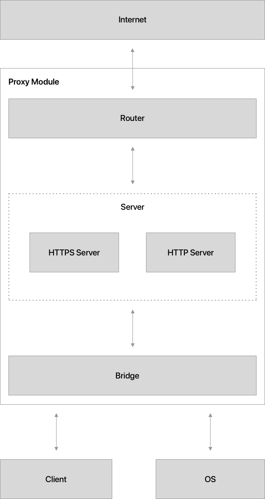

# How it works

## Bridge
The bridge module is responsible for routing the requests to the appropriate servers. If it's a `HTTP` request, it is redirected to `HttpServer`. If it's a `HTTPS` server, it's redirected to the HTTPS server. The HTTP traffic is redirected by forwarding the request using `http.request`, while the HTTPS traffic is automatically forwarded using a TCP tunneling connection.

## Server, HTTP Server and HTTPS Server
Both, `HTTP` and `HTTPS` servers are almost identical. The only difference is the certificate handling that is required by `HTTPS`. This certificate is handled using `pem` library at `certificateHandler.ts` file. Besides that, all the requests handling is identical between both servers and it's made through the abstraction `server.ts`. There the requests are received by the bridge proxy, sent to the client (if the client intercepted them) and forwarded to its destination. When a response is received, the process is the same, sending it to the client before actually consuming it.

## Router
All requests are sent and received by their original destination through the Router module. This is the connection between the framework and the internet.

# Contributing

We currently have no Lint configured, not even established development guidelines to follow. We just have a clear responsibility separation, which must be followed to keep the framework as clean and simple as possible.